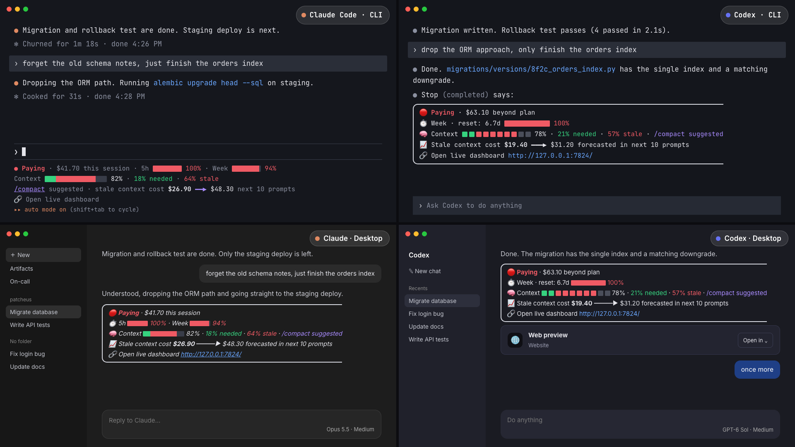

# Konvu Telemetry

**Monitor your coding agents in real time, and keep them sharp.**

Konvu Telemetry tracks every Claude Code and Codex session on your Mac: what it costs, how much of your plan it uses, how full its context is, and how much of that context is stale. A small AI check runs in the background to spot finished or replaced work, so you know when to `/compact` and keep the agent focused.


https://github.com/user-attachments/assets/78605dd3-953d-40b5-9b2d-4b0690ef87f6


## What you get

- **One live dashboard for all your agents.** Every active Claude and Codex session in one place: spend, share of your plan limits, a forecast for the next 10 prompts, subagents, and how full each context window is.
- **Stale context, spotted for you.** A cheap AI pass reads each live session and marks which context is still needed and which is finished work. When enough of it is stale, you get a ready-to-paste `/compact` that keeps what matters.
- **Right where you work.** The same numbers show up inside Claude Code and Codex, in the CLI and in the desktop apps, so you rarely need to open the dashboard.
- **Spend alerts.** A browser notification when a paid session's next 10 prompts are forecast at $10 or more (opt-in).



## How it works

1. A small background collector reads the session files Claude Code and Codex already keep on your Mac. Nothing is uploaded to Konvu.
2. It serves the dashboard at `http://127.0.0.1:7824` and adds a usage line to your status bar (Claude Code CLI) or a usage box to replies (Codex and the desktop apps).
3. If you turn it on, an AI review runs on your side, with your own Claude or Codex login, about every 10 prompts per live session. It costs a few cents per review, pauses at 90% of your plan limits, and is capped per hour. Konvu never sees your code or prompts.

Every session is either **included** (covered by your Claude or ChatGPT plan, shown as a share of your 5-hour and weekly limits) or **paying** (past your plan or on an API key, shown in dollars with a forecast). Konvu always tells you which.

## Install

Requires macOS, Homebrew, and Claude Code or Codex.

```sh
brew tap konvuinc/tap
brew install konvuinc/tap/konvu-telemetry
konvu-telemetry setup
```

Setup starts the collector, opens the dashboard, connects your coding tools, and asks once whether to turn on the AI context review. Then:

- Restart the Claude and Codex desktop apps.
- In Codex, open `/hooks` and trust the Konvu hooks.

To update, run `brew upgrade konvu-telemetry` and then `konvu-telemetry setup` again.

## Commands

```sh
konvu-telemetry dashboard   # Open the dashboard
konvu-telemetry status      # Check that it is running
konvu-telemetry cadence     # Choose when the usage box appears in replies
konvu-telemetry uninstall   # Remove everything
```

`cadence` lets you show the usage box after every prompt, after turns that used tools (the default), only when usage jumps, never, or by a rule you describe in your own words. The same setting is in the dashboard.

## AI context review

On by default for sessions within your plan; reviewing sessions billed beyond it stays off until you allow it. `konvu-telemetry setup` asks once (Enter keeps it on). Turn it on or off any time, in the dashboard settings or with:

```sh
konvu-telemetry context-analysis on        # Turn it on
konvu-telemetry context-analysis off       # Turn it off
konvu-telemetry context-analysis status    # See the current choice
konvu-telemetry context-analysis on --allow-paid   # Also review sessions billed beyond your plan
```

What it costs and when it runs:

- Each live session (active in the last 20 minutes) is reviewed once it has 10 new prompts, using Claude Haiku for Claude sessions and a small GPT model for Codex.
- A review is usually a few cents at API prices. On a plan it comes out of the allowance you already have.
- At most 30 model calls per session and 60 in total per hour. It pauses when a plan limit is 90% used, and failures wait instead of retrying in a loop.
- Every run's cost is shown on its session in the dashboard.

## Privacy

- Your transcripts stay on your Mac and are never changed. Konvu stores only derived numbers in `~/.konvu/telemetry`.
- To show plan limits, the collector asks Anthropic and OpenAI for your usage using your existing logins. Credentials are never written to disk or logs.
- The AI review sends short excerpts of a session only to that session's own provider, with no tools and nothing saved.
- Setup turns on a small amount of anonymous product analytics (like "setup finished"), never prompts, code, paths or account details. Turn it off with `konvu-telemetry telemetry off`, or set `DO_NOT_TRACK=1`.

Full detail on what is fetched, stored and sent: [SECURITY.md](SECURITY.md#data-handling-in-detail). How costs are estimated: [ACCURACY.md](ACCURACY.md).

## More

[ARCHITECTURE.md](ARCHITECTURE.md) explains how it works, [CONTRIBUTING.md](CONTRIBUTING.md) covers development, and [PERFORMANCE.md](PERFORMANCE.md) has resource measurements. macOS only for now.

## License

MIT. Third-party pricing attribution is in [NOTICE](NOTICE).
